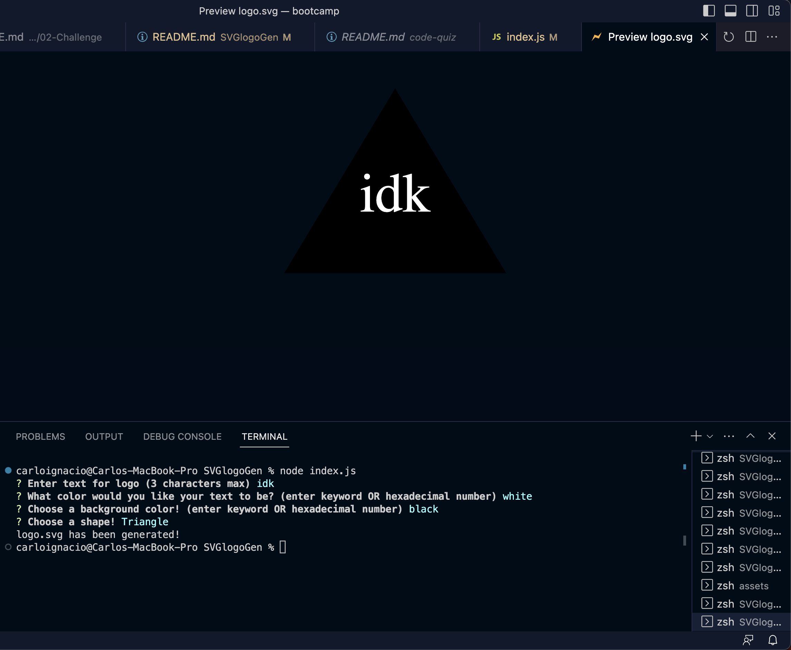

# SVGlogoGen

## Description
This app is used to generate a simple customized logo in an .svg file through the command line. It is designed to create your custom logos without the use of a graphic designer. Users will be prompted for desired text, text color, background color, and shape. Once the user inputs are entered, a logo.svg file will be created.

## Technologies Used

JavaScript
Node.js
Jest
Inquirer.js

## Installation

-Clone the repository: git@github.com:casignacio/SVGlogoGen.git

-Install the following using npm install:
    Node.JS
    Jest
    Inquirer.js

## Usage

To use this app, please download node, jest, and inquirer using npm install. After the packages are properly installed then run node.js in the intergrated terminal for the repository and follow the prompts. Once all prompts have been answered, the logo.svg will be generated!

## Screenshots

## Video Link

https://drive.google.com/file/d/1vcTxBQS1JSrjyjq3JW7GDrNZYsGYIVjb/view